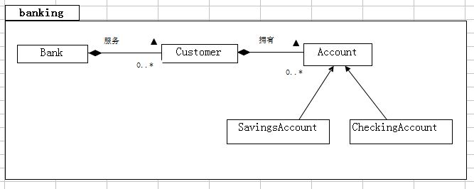

#     JAVA专周开发实战
 #### 简介:基于JAVA的Bank项目开发实战,用于学生学习，学会 继承,多态等方法功能的实现。

### 一、 安装
1. **安装IDEA**
2. **安装必要插件**
 - JDK11
 - GitHub
### 二、 功能
- 用户账户管理：创建账户（储蓄账户、支票账户）
- 存款：向指定账户存款
- 取款：从指定账户取款
- 转账：在账户之间转账

### 三、使用方法
1. 在IDEA中打开 WEEK18 该文件
2. 点击你想测试的任意类
3. 运行它，等待，然后查看结果

### 四、核心类
1. Account
2. Bank
3. CheckingAccount
4. Customer
5. CustomerReport
6. OverDrafEXception
7. SavingAccount

### 五、开发
如果你想修改该项目，请点击该链接，下载修改:
> https://github.com/shluei/shluei-github.io

### 六、学习要点
通过本项目可掌握：
* 继承：账户体系的层级关系设计
* 多态：统一接口处理不同类型账户
* 异常处理：自定义异常

### 七、致谢
感谢杨老师的一周练习。QWQ
